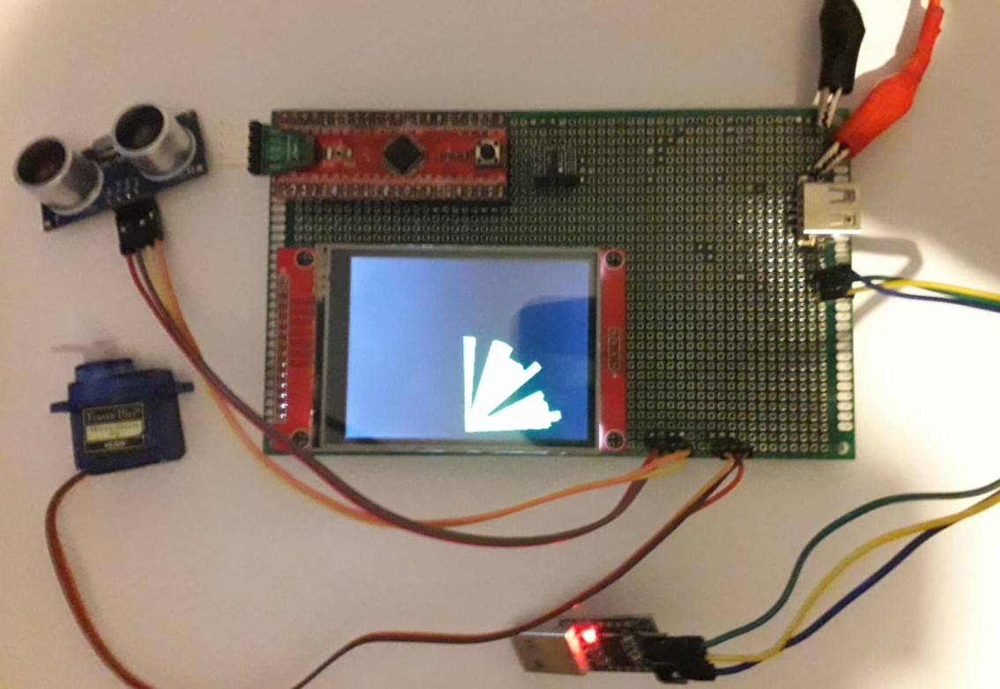

# Radar Project PMIK 2023Z 📡

## Introduction 🎯

Welcome to the **Radar Project PMIK 2023Z**! This project is a simulation of a radar system designed to detect objects in a 2D plane. It is a part of the PMIK 2023Z coursework and demonstrates the principles of radar technology, signal processing, and object detection. Main goal of the project is to measure distnace to the objects, on the surface of 180 degrees, which is possible by usage of simple servomotor. Measurement is visualized on LCD display. All settings can be accesed by UART interface conected to computer COM port.

The project is implemented in **C** language on **STM32** microcontroller using dedicated **STM32CubeIDE** enviroment.

---



## Hardware 🤖

- Microcontroller ARM STM32GX, core Cortex M0+
- Ultrasonic distance sensor with range about 2-200cm
- Servomotor with movement range 180 degrees, controlled by PWM wave with certain period and fulfillment
- LCD TFT display, resolution 320x240px with SPI interface
- Converter TTL UART-USB
- Extennal power supply 5V from powerbank

## Project setup 🛠️

To set up the project locally, follow these steps:

1. **Clone the Repository**:
   ```bash
   git clone https://github.com/FRSH-0109/Radar_Project_PMIK_2023Z.git
   ```
   
2. **Import project via wizard in STM32CubeIDE**:
   In the left upper corner pick *File* -> *Import*

---

## 📜 Feel free to use this project!

This project is licensed under the **[MIT License](LICENSE)**.

---